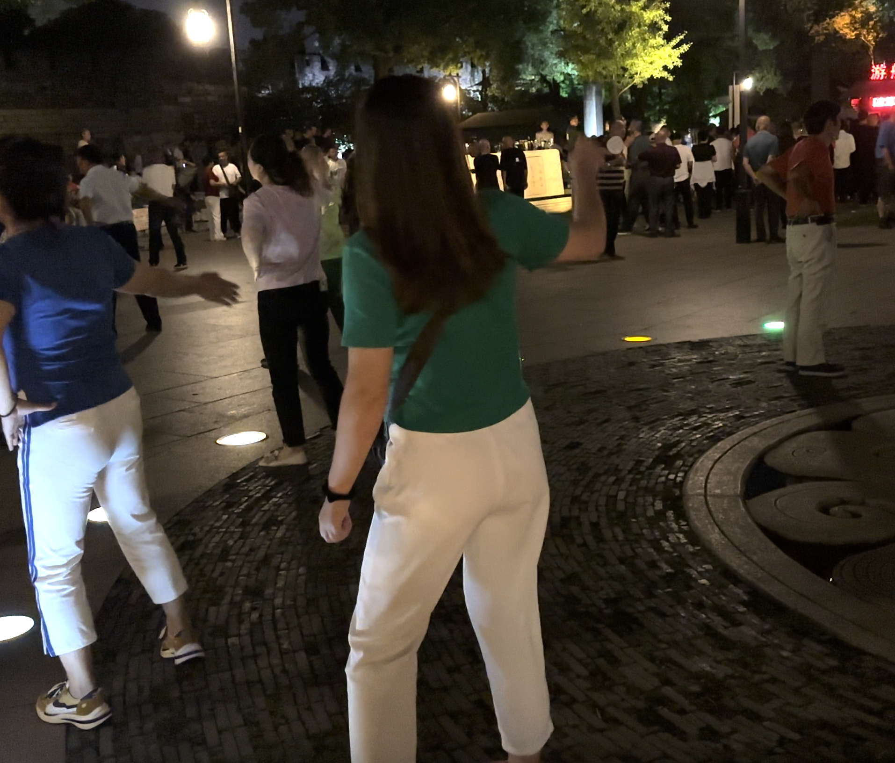

2023-08-31

八月的最后一天, 和妈妈去大公园, 也就是苏州环护城河步道逛了逛. 晚风很凉, 公园十分热闹, 许多老头老太太跳广场舞. 妈妈指着他们, 哈哈你看他们好开心啊, 等我退休了也要去跳. 

不, 跳广场舞蠢死了, 老年人才跳那个, 我不要你跳. 

我就要跳, 我也老了呀.

那些跳的人是老头老太太, 你不一样, 你是我妈.

妈妈拉着我加入人群, 跟着前面的人手舞足蹈起来. 我录了像, 看回放时鼻子一酸, 画面中的她又老又胖, 动作无力, 脸上有黄斑眼角有皱纹, 可偏偏精神那么好, 脸上还笑着. 我忍不住了, 呜呜地哭了出来.

妈妈, 你好老啊.

我本来就老了啊, 哪有人不老的. 她的回答很冷静.

你又老, 又胖. 我小的时候你不是这样的.

哎呀, 我不老那不成妖怪了, 老就老呗.

眼泪簌簌落下, 我感到自己很没用, 很可恶, 我的妈妈辛苦了大半生, 而我骄横地享受着她辛勤劳动的成果, 不时地表达虚荣与不屑, 从未体谅过. 小的时候, 我活在她编织的伞里, 以为那是牢笼; 拥有她能给的一切, 还嫌不够多. 我恨恨地想着这些罪过, 现在好了, 马上要走, 哪里有补偿的机会. 道路静悄悄的, 广场已经过去, 喧嚣声消失了, 但树上的蝉一直叽叽喳喳地响, 像一根锯子, 似乎有人很懊恼, 烦躁地锯着自己的神经.

我还记得高中时候, 想买一个kindle, 这是个阅读电子书的小屏幕, 售价一千元. 在此之前我花过最多的钱是买几十元的游戏点卡. 买嘛买嘛, 我缠着爸妈, 这个对我有用. 骗人的, 我暗想, 它的用处是向同学们炫耀, 以及看小说不再需要偷老妈的手机.

这不就是个看书的吗, 你买书看不行? 它那么贵, 我们可买不起.

可是别人都有. 我虚张声势地喊.

一阵沉默.

一周后回到家, 正要扑到电脑桌前玩游戏, 突然看到玻璃桌面上放着个小盒子, 上头躺着个黑色长方形物事. 我悉心辨识出那就是我心心念念的kindle. 爸妈出现在身后, 粗糙面孔上浮起笑容. 怎么样? 你妈偏要给你买. 暮色的光线投在房间门口, 他们的鞋子上亮起几个窗棂投射成的矩形图案. 我垂首站在桌前看着自己的裤管, 过了两秒钟, 突然大吼, 你们出去吧, 我要玩游戏了, 不要打扰我.

我打了个寒噤, 突然觉得前方的道路开始旋转, 模糊, 幻化成那个房间, 十八岁的我发出恐怖的吼声. 刹那间我又听到了爸妈的言语, 看到了爸妈温和的眼睛.

你哭什么?

妈妈, 我不想让你受苦.

我怎么会苦呢? 我都要退休了, 还有四年, 退休之后想干嘛干嘛, 天天养花养金鱼.

妈妈, 我一想到你忙了大半辈子, 还要受苦, 就难过.

你关心好你自己吧, 我好得很呢.

妈妈, 我自己苦不要紧, 我有能力, 到哪里都能过得好. 可是你不能受苦, 你年纪大了.

妈妈, 对不起.

对不起对不起对不起.

