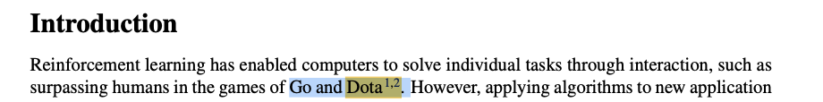
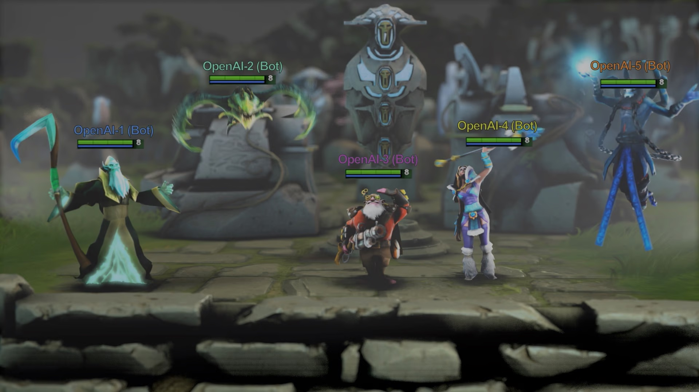
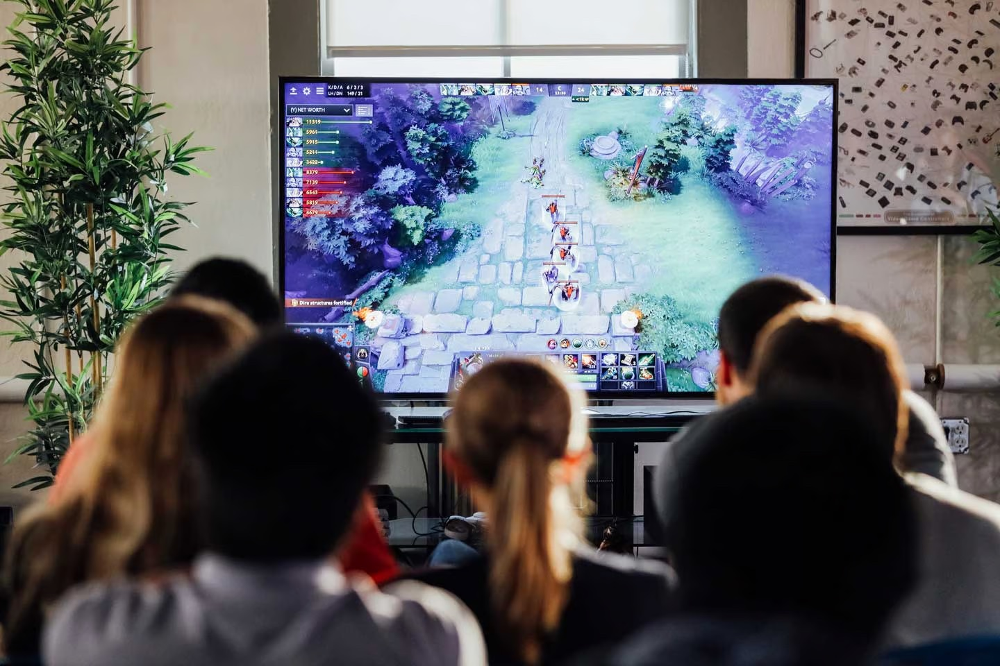

2023年10月, 我加入了Yubei Chen[^1]教授的实验室, Chen教授主要从事SSL(自监督学习)的研究. 在他的指导下, 我或许能成为一个计算机科学家.

10-27下午, 我看了两篇world model的论文:

1. World Models[^2] (NIPS 2018 Oral)
2. DreamverV3[^3]

第一篇看得十分振奋, 作者很厉害, 对神经科学也有不少洞见. 看起来SSL和强化学习的机制真的就和人脑的机制一样, 这个方向很有潜力. 

DreamverV3里说了个好笑的事: specific domain的RL已经有了些成果(Figure 1), 分别在Go和Dota2:

OpenAI five[^4]这个model已经战胜了Ti(Dota2最高赛事)世界冠军OG(Figure2, 3). 话说这个现场演示我还在某一年的Ti见过来着

查了一下, 那是2018年, 我还没上大学, 也还没学计算机, 更不知道机器学习和人工智能, 没想到我的命运会在未来的某一时刻与它发生联系. 

命运真奇妙, 2018年我在电脑上观看Ti游戏直播, 突然有伙人来展示了一个不明所以的东西, 五年后我投身于这个领域, 看到一篇paper讲当年的事情, 才知道他们就是OpenAI, 那个东西就是人工智能.

[^1]:  https://yubeichen.com/

[^2]: https://worldmodels.github.io/

[^3]: https://danijar.com/project/dreamerv3/

[^4]: https://openai.com/research/openai-five